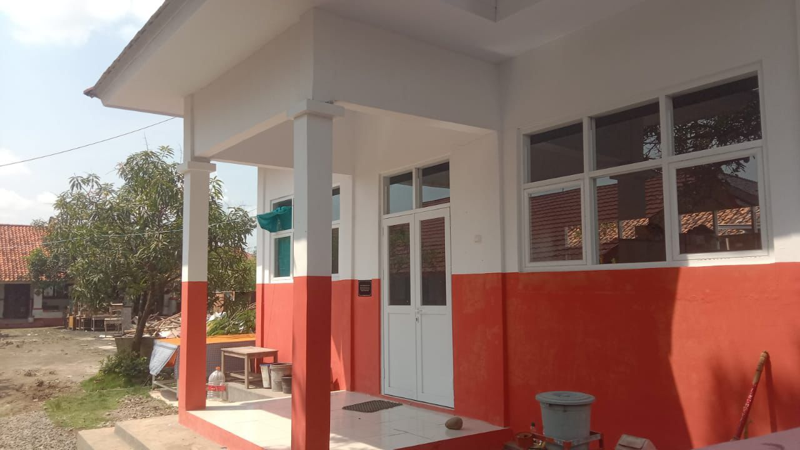
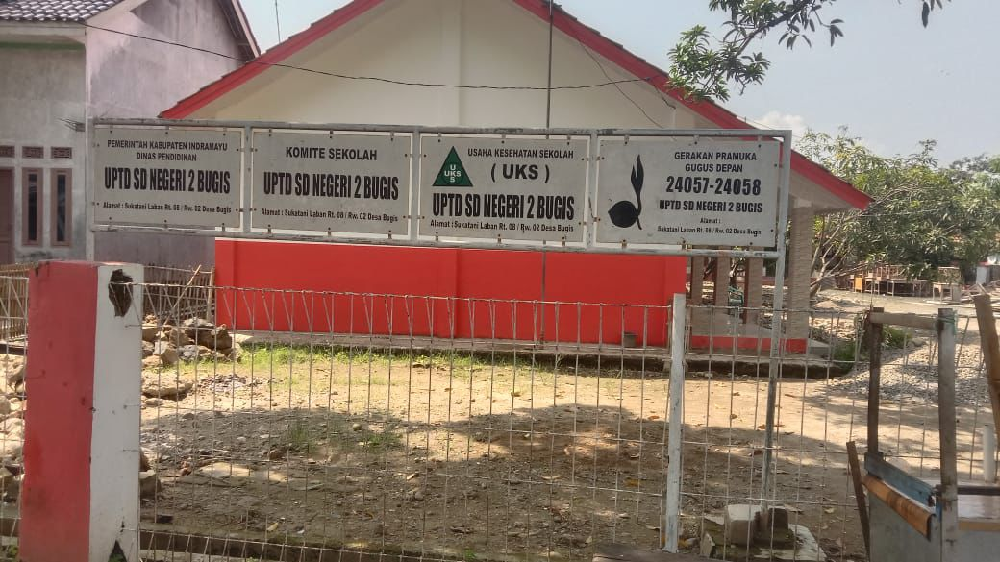
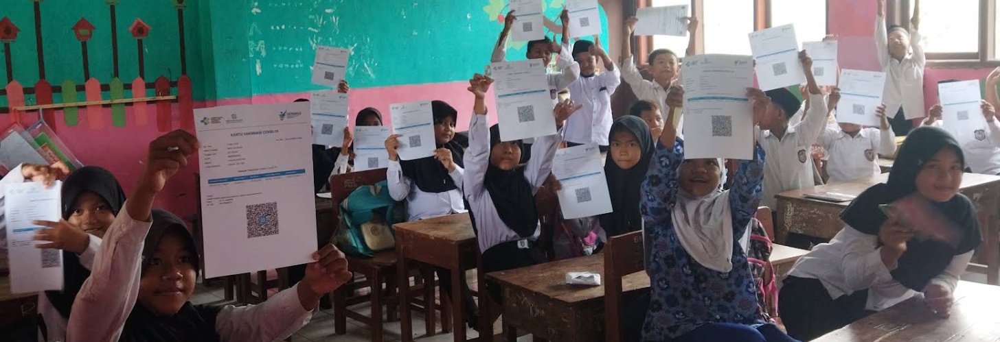
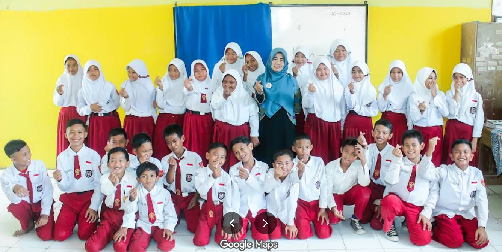

<!DOCTYPE html>
<html lang="id">
<head>
    <meta charset="UTF-8">
    <meta name="viewport" content="width=device-width, initial-scale=1.0">
    <title>SD Negeri 2 Bugis - Profil & Kegiatan</title>
    
    <link href="https://fonts.googleapis.com/css2?family=Inter:wght@400;600;700&display=swap" rel="stylesheet">
    <link rel="stylesheet" href="https://cdnjs.cloudflare.com/ajax/libs/font-awesome/6.0.0-beta3/css/all.min.css" />

    
</head>
<body class="text-gray-800">

    <nav class="sticky top-0 z-50 bg-white/95 backdrop-blur-md shadow-md border-b border-gray-100">
        

            

                

                    <i class="fas fa-school text-red-600 text-2xl"></i>
                    SDN 2 BUGIS
                

                

                    <a href="#home" class="text-gray-600 hover:text-red-600 font-medium transition">Beranda</a>
                    <a href="#profile" class="text-gray-600 hover:text-red-600 font-medium transition">Profil</a>
                    <a href="#gallery" class="text-gray-600 hover:text-red-600 font-medium transition">Kegiatan</a>
                    <a href="#contact" class="text-gray-600 hover:text-red-600 font-medium transition">Kontak</a>
                

                

                    <button id="mobile-menu-btn" class="text-gray-600 hover:text-red-600 focus:outline-none">
                        <i class="fas fa-bars text-xl"></i>
                    </button>
                

            

        

        

            

                <a href="#home" class="block py-2 text-gray-700 hover:text-red-600">Beranda</a>
                <a href="#profile" class="block py-2 text-gray-700 hover:text-red-600">Profil</a>
                <a href="#gallery" class="block py-2 text-gray-700 hover:text-red-600">Kegiatan</a>
                <a href="#contact" class="block py-2 text-gray-700 hover:text-red-600">Kontak</a>
            

        

    </nav>

    <section id="home" class="header-bg py-24 sm:py-32">
        

            
                Selamat Datang di Website Resmi
            
            <h1 class="text-4xl sm:text-6xl font-extrabold mb-6 leading-tight drop-shadow-lg">
                SD NEGERI 2 BUGIS
            </h1>
            

                Mewujudkan Generasi yang Cerdas, Berkarakter, dan Berakhlak Mulia.
            

            

                <a href="#gallery" class="bg-white text-red-700 font-bold py-3 px-8 rounded-full shadow-lg hover:bg-gray-100 transition transform hover:scale-105">
                    Lihat Kegiatan
                </a>
                <a href="#contact" class="bg-transparent border-2 border-white text-white font-bold py-3 px-8 rounded-full hover:bg-white hover:text-red-700 transition">
                    Hubungi Kami
                </a>
            

        

    </section>

    <section id="profile" class="py-16 bg-white">
        

            

                

                    <h2 class="text-3xl font-bold text-gray-900 mb-6 border-l-4 border-red-600 pl-4">
                        Lingkungan Belajar Nyaman
                    </h2>
                    

                        SD Negeri 2 Bugis berkomitmen menyediakan fasilitas pendidikan yang layak dan aman. Gedung sekolah kami yang terawat dengan nuansa merah putih menumbuhkan semangat kebangsaan dan kenyamanan bagi para siswa dalam menuntut ilmu.
                    

                    <ul class="space-y-4">
                        <li class="flex items-center text-gray-700">
                            <i class="fas fa-check-circle text-green-500 mr-3 text-lg"></i> Gedung Permanen & Terawat
                        </li>
                        <li class="flex items-center text-gray-700">
                            <i class="fas fa-check-circle text-green-500 mr-3 text-lg"></i> Halaman Luas & Aman
                        </li>
                        <li class="flex items-center text-gray-700">
                            <i class="fas fa-check-circle text-green-500 mr-3 text-lg"></i> Lokasi Strategis di Desa Bugis
                        </li>
                    </ul>
                

                
                

                    

                        
                    

                    

                        
                    

                

            

        

    </section>

    <section id="gallery" class="py-20 bg-gray-50">
        

            

                Dokumentasi
                <h2 class="text-3xl sm:text-4xl font-bold text-gray-900 mt-2">Galeri Kegiatan Sekolah</h2>
                

                

                    Potret aktivitas siswa, guru, dan lingkungan SD Negeri 2 Bugis dalam keseharian.
                

            

            

                
                

                    

                        
                        

                            Kecerian Kelas
                        

                    

                    

                        <h3 class="font-bold text-xl mb-2 text-gray-800">Kegiatan Belajar Mengajar</h3>
                        
Keakraban antara guru dan siswa menciptakan suasana belajar yang menyenangkan dan interaktif di dalam kelas.

                    

                

                

                    

                        
                        

                            Program Kesehatan
                        

                    

                    

                        <h3 class="font-bold text-xl mb-2 text-gray-800">Kesehatan Siswa</h3>
                        
Pelaksanaan program kesehatan dan vaksinasi untuk memastikan seluruh siswa tetap sehat dan siap belajar.

                    

                

                

                    

                        
                        

                            Lingkungan Sekolah
                        

                    

                    

                        <h3 class="font-bold text-xl mb-2 text-gray-800">Fasilitas Sekolah</h3>
                        
Gedung sekolah yang representatif, bersih, dan asri dilihat dari jalan utama Desa Bugis.

                    

                

                 

                    

                        
                        

                            Identitas Resmi
                        

                    

                    

                        <h3 class="font-bold text-xl mb-2 text-gray-800">Profil Kelembagaan</h3>
                        
Terdaftar resmi sebagai UPTD SD Negeri 2 Bugis, siap melayani pendidikan dasar bagi masyarakat sekitar.

                    

                

                

                    

                        
                        

                            Gedung Sekolah
                        

                    

                    

                        <h3 class="font-bold text-xl mb-2 text-gray-800">Sarana Prasarana</h3>
                        
Kondisi bangunan yang kokoh dan estetis dengan cat kombinasi merah putih yang baru diperbarui.

                    

                

                
                

                    <i class="fas fa-quote-left text-4xl mb-4 opacity-50"></i>
                    
"Pendidikan adalah senjata paling ampuh untuk mengubah dunia."

                    
- Nelson Mandela

                    

                        
Bergabunglah bersama kami di SDN 2 Bugis.

                    

                

            

        

    </section>

    <footer id="contact" class="bg-gray-900 text-white pt-16 pb-8">
        

            

                

                    <h4 class="text-2xl font-bold text-red-500 mb-4">SD N 2 BUGIS</h4>
                    

                        Jl. Sukatani Laban, Desa Bugis,  
                        Kec. Anjatan, Kab. Indramayu, 
                        Jawa Barat 45256
                    

                

                

                    <h4 class="text-lg font-bold mb-4">Kontak Kami</h4>
                    <ul class="space-y-3 text-gray-400">
                        <li class="flex items-center"><i class="fas fa-phone mr-3 text-red-500"></i> (0234)082237889061</li>
                        <li class="flex items-center"><i class="fas fa-envelope mr-3 text-red-500"></i> info@sdn2bugis.sch.id</li>
                        <li class="flex items-center"><i class="fas fa-clock mr-3 text-red-500"></i> Senin - Sabtu: 07.00 - 13.00</li>
                    </ul>
                

                

                    <h4 class="text-lg font-bold mb-4">Peta Lokasi</h4>
                    

                        <iframe 
                            src="https://www.google.com/maps/embed?pb=!1m18!1m12!1m3!1d3964.832269661448!2d107.9547!3d-6.4156!2m3!1f0!2f0!3f0!3m2!1i1024!2i768!4f13.1!3m3!1m2!1s0x0%3A0x0!2zNsKwMjQnNTYuMiJTIDEwN8KwNTcnMTYuOSJF!5e0!3m2!1sid!2sid!4v1620000000000!5m2!1sid!2sid" 
                            width="100%" height="100%" style="border:0;" allowfullscreen="" loading="lazy">
                        </iframe>
                    

                    <small class="text-gray-500 mt-2 block">*Peta area Kecamatan Anjatan</small>
                

            

            

                
&copy; 2025 SD Negeri 2 Bugis. All rights reserved.

                
Prototipe Web Sekolah.

            

        

    </footer>

    
</body>
</html>
